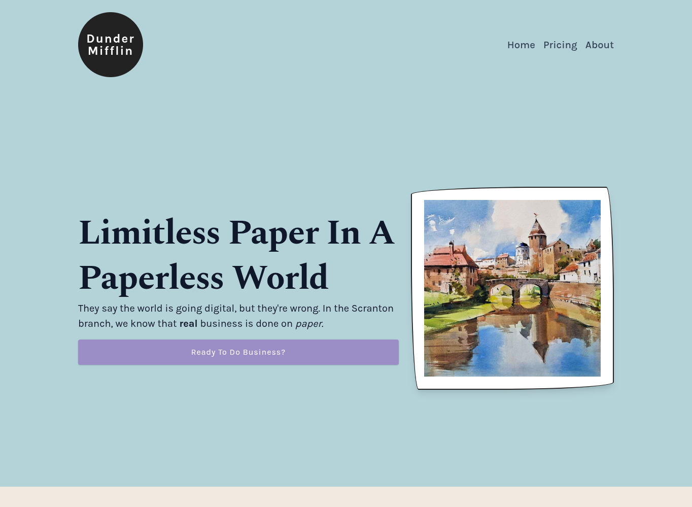
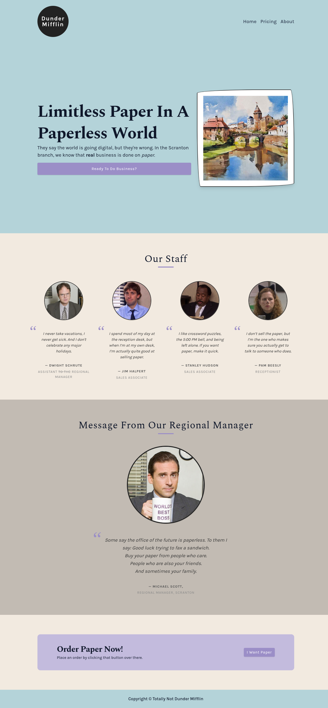

# Dunder Mifflin Landing Page

A landing page for a mid-sized, <em>fictional</em> paper company.

## 📄 About the Project

### 🏢 Why Dunder Mifflin?

I have watched _The Office_ a lot and have re-watched many many times as well.
I really really loved it and when I was about to make a Landing Page Project it was only natural that I, a huge fan, make one for my favorite mid-sized Scranton paper company: Dunder-Mifflin.

## 🚀 Live Demo

Link to live demo. (Coming soon)

## 📸 Preview

|                                 Hero View                                 |                                  Overall Page                                   |
| :-----------------------------------------------------------------------: | :-----------------------------------------------------------------------------: |
|  |  |

## 🛠 Tech Stack

- HTML
- CSS (Flexbox, Custom Properties)
- git

## 💻 Getting Started

To view this project locally:

1. Clone the repository.
   ```bash
   git clone git@github.com:ThePaladinDev/dunder-mifflin-landing-page.git
   ```
2. Navigate into the directory.
   ```bash
   cd dunder-mifflin-landing-page
   ```
3. Start a local HTTP server:<br>
   - VS Code: Use the [Live Server](https://marketplace.visualstudio.com/items?itemName=ritwickdey.LiveServer) extension.
   - Node.js: Run `npx serve .` (Default port: 3000).
   - Python: Run `python -m http.server` (Default port: 8000)

4. Open your browser and navigate to the URL provided in your terminal (e.g., `http://localhost:PORT/`).

5. Stop the server by pressing `Ctrl+C` in the terminal once you're done testing the project.

## ✨ Features

- **Modern Layout:** A clean, responsive landing page for a fictional business.
- **Responsive Design:** Designed to work across various screen sizes.

## 🧠 What I learned

- **Logo Design:** Creating a logo using only HTML markup and CSS styles.
- **UI Design:** Making the 'Hero' section of the page pleasing to the eyes along with a clear call to action.
- **Layout Spacing**: Understanding the importance of section height and padding to prevent a crowded UI.
- **Flexbox:**
  - Used the 'Flex' layout extensively across the project.
  - Used `flex-wrap` and `flex-basis` to achieve a responsive layout **without using media queries**.
- **CSS Architecture:**
  - Importance of CSS resets.
  - Learned a lot about Color palettes. Used a combination of shades and tints of my chosen colors to achieve a cohesive look across the page.
  - Extensively used CSS custom properties (or CSS variables as they are commonly called) throughout my stylesheets.
  - I've learned to use the CSS Variables to achieve flexibility. Now I can easily change the color scheme and typography by just tinkering with a few CSS variables.

## 🏁 Conclusion

Overall I am very happy with how this project turned out. I have learned a lot while working on this deceptively simple landing page project.

## 📜 License

This project is licensed under the MIT License - see the [LICENSE](./LICENSE) file for details.
